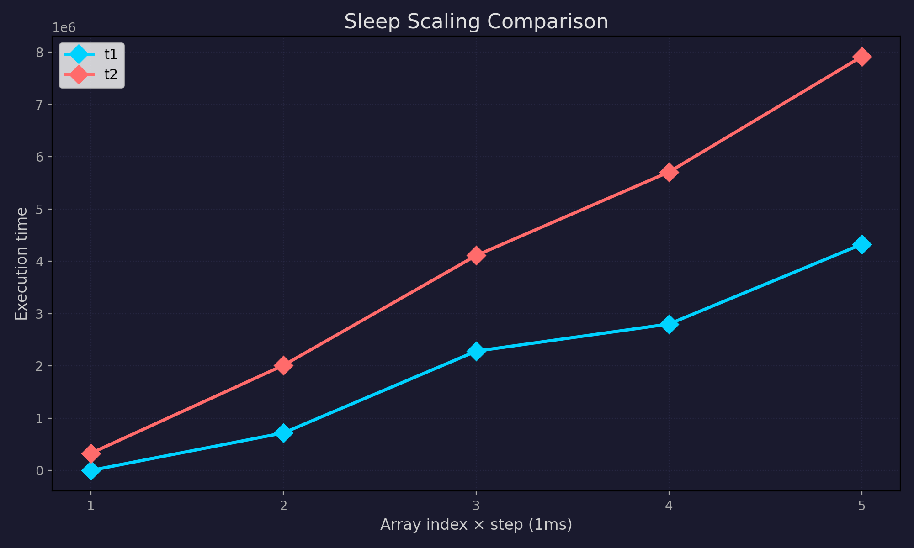

# fastest

> **Warning:** This README was generated by AI from the project source files, headers, and live terminal output. It may lag behind the actual code.

A macro-based C testing framework built around a global test scheduler. Tests register themselves before `main()` via `__attribute__((constructor))` and can be run from C or Python. Nanosecond-precision timing and memory tracking included; zero external dependencies for the core library.

## Table of Contents

- [Project Structure](#project-structure)
- [Building](#building)
- [Integration](#integration)
- [Testing Modes](#testing-modes)
- [Flags Reference](#flags-reference)
- [Python Bindings](#python-bindings)
- [Python Package](#python-package)
- [Plotting](#plotting)
- [Examples](#examples)

---

## Project Structure

```
fastest/
├── include/fastest/
│   ├── tests.h             # Core types, flags, status codes, helper macros
│   ├── test_list.h         # Test scheduler (list, push, exec, get_instance)
│   ├── logging.h           # ANSI output macros
│   ├── quick_tests.h       # FASTEST_QUICKTEST
│   └── custom_tests.h      # FASTEST_CUSTOMTEST / INLINE / DINLINE macros
├── src/
│   ├── logging.c           # FASTEST_print_result, FASTEST_print_error
│   └── test_list.c         # Scheduler implementation
├── bindings/
│   ├── pybind.cpp          # pybind11 extension (compiled per-project)
│   ├── setup.py
│   ├── pyproject.toml
│   └── requirements.txt    # setuptools, wheel, pybind11, packaging
├── fastest_py/             # Pure-Python orchestration package
│   ├── pyproject.toml
│   └── src/fastest/
│       ├── __init__.py     # Module facade, default_runner
│       ├── flags.py        # Python mirror of tests.h bitmasks + helpers
│       ├── logging.py      # ANSI color helper
│       ├── plotting.py     # Matplotlib-based Plotter (optional)
│       └── runner.py       # Runner, Pool, Stats, CompareResult
├── demo/
│   ├── shared_Makefile
│   ├── shared_build_wheel.sh
│   ├── shared_run_tests.sh
│   ├── scaling_test/       # Scaling benchmark demo
│   └── showcase/           # Basic feature demo
├── build/
│   └── libfastest.a        # Static library (generated)
└── CMakeLists.txt
```

---

## Building

### Prerequisites

- GCC / Clang (C11)
- G++ (C++17, for Python bindings)
- CMake ≥ 3.15
- pybind11 ≥ 2.11 (Python bindings only)
- matplotlib (plotting only)

### Static Library

```bash
cmake -B build
cmake --build build
# Produces build/libfastest.a
```

---

## Integration

### C-only

```bash
cp build/libfastest.a /your/project/lib/
cp -r include/fastest /your/project/include/

gcc -std=c11 -o tests tests.c -Iinclude -Llib -lfastest
```

Add `-DDEBUG` to enable `DEBUG_PRINTF` output.

### Demo project layout

```
your-demo/
├── src/
├── vendor/
│   └── fastest/      # symlink or copy of the fastest repo root
├── Makefile          # symlink to fastest/demo/shared_Makefile
└── build_wheel.sh    # symlink to fastest/demo/shared_build_wheel.sh
```

```bash
ln -s /path/to/fastest/demo/shared_Makefile Makefile
ln -s /path/to/fastest/demo/shared_build_wheel.sh build_wheel.sh
mkdir -p vendor && ln -s /path/to/fastest vendor/fastest
```

```bash
make              # release build → build/release/lib<name>.a
make BUILD=debug  # debug build with -g -O0 -DDEBUG
make clean
```

---

## Testing Modes

### 1. QUICKTEST — Expression-based

Does **not** register in the scheduler. Result is printed immediately.

```c
FASTEST_QUICKTEST(name, expr, flags)
```

```c
FASTEST_QUICKTEST("add 2+3==5", add(2, 3) == 5,
    FASTEST_ASSERT_EQ | FASTEST_FAIL_ERROR | FASTEST_TIME_NS);
```

### 2. CUSTOMTEST — Scheduler-registered function

```c
void my_test(FASTEST_TestOutput_t *out) {
    out->test_flags  |= FASTEST_ASSERT_EQ;
    out->exit_status |= add(2, 3) == 5 ? FASTEST_SUCCESS : FASTEST_ERROR_ASSERT;
}

FASTEST_CUSTOMTEST("my test", FASTEST_TIME_NS | FASTEST_FAIL_ERROR, my_test, NULL);
```

### 3. CUSTOMTEST\_INLINE — Inline body, external callback

```c
void after(FASTEST_TestOutput_t *out) {
    DEBUG_PRINTF("%s done", out->test_name);
}

FASTEST_CUSTOMTEST_INLINE("inline add", FASTEST_TIME_NS | FASTEST_FAIL_ERROR,
    after,
    {
        out->test_flags  |= FASTEST_ASSERT_EQ;
        out->exit_status |= add(2, 3) == 5 ? FASTEST_SUCCESS : FASTEST_ERROR_ASSERT;
    }
)
```

### 4. CUSTOMTEST\_DINLINE — Fully inline

```c
FASTEST_CUSTOMTEST_DINLINE("dinline add",
    FASTEST_TIME_NS | FASTEST_FAIL_ERROR,
    { DEBUG_PRINTF("%s done", out->test_name); },
    {
        out->test_flags  |= FASTEST_ASSERT_EQ;
        out->exit_status |= add(2, 3) == 5 ? FASTEST_SUCCESS : FASTEST_ERROR_ASSERT;
    }
)
```

### Running Scheduled Tests from C

```c
#include "fastest/test_list.h"

int main(void) {
    FASTEST_List_t *list;
    FASTEST_list_get_instance(&list);
    FASTEST_list_exec_name(list, "my test");
    FASTEST_list_exec(list, 0);
    return 0;
}
```

---

## Flags Reference

Flags are `uint64_t` bitmasks combined with `|`.

### Assertion

| Flag | Assertion |
|------|-----------|
| `FASTEST_ASSERT_EQ` | `==` |
| `FASTEST_ASSERT_NEQ` | `!=` |
| `FASTEST_ASSERT_GT` | `>` |
| `FASTEST_ASSERT_GE` | `>=` |
| `FASTEST_ASSERT_LT` | `<` |
| `FASTEST_ASSERT_LE` | `<=` |

### Failure reporting

| Flag | Output style |
|------|-------------|
| `FASTEST_FAIL_ERROR` | Red `[FASTEST ERROR]` |
| `FASTEST_FAIL_WARNING` | Yellow `[FASTEST WARNING]` |
| `FASTEST_FAIL_LOG` | Blue `[FASTEST LOG]` |

### Timing

| Flag | Unit |
|------|------|
| `FASTEST_TIME_NS` | nanoseconds |
| `FASTEST_TIME_US` | microseconds |
| `FASTEST_TIME_MS` | milliseconds |
| `FASTEST_TIME_S` | seconds |

> `time_ns` in the Python dict is always nanoseconds. The timing flag is a C-side print hint only.

### Misc

| Flag | Effect |
|------|--------|
| `FASTEST_MEM_TRACK` | Track allocation/deallocation, report leaks |
| `FASTEST_DEFAULT_LOG` | Enable `FASTEST_print_result` output |

### Exit status codes

| Code | Meaning |
|------|---------|
| `FASTEST_SUCCESS` | Test passed |
| `FASTEST_SKIPPED` | Test skipped |
| `FASTEST_INCOMPLETE` | Test did not finish |
| `FASTEST_ERROR_ASSERT` | Assertion failed |
| `FASTEST_ERROR_MEMORY` | Memory leak detected |
| `FASTEST_ERROR_TIMEOUT` | Test exceeded time limit |
| `FASTEST_ERROR_EXCEPTION` | Signal or fatal error |
| `FASTEST_ERROR_UNEXPECTED` | Unexpected result |
| `FASTEST_ERROR_RESOURCE` | I/O or resource failure |
| `FASTEST_ERROR_MPI` | MPI failure |
| `FASTEST_ERROR_OMP` | OpenMP failure |
| `FASTEST_ERROR_CUDA` | CUDA failure |
| `FASTEST_ERROR_INTERNAL` | Framework misuse |
| `FASTEST_ERROR_COLLISION` | Duplicate test name |
| `FASTEST_ERROR_NOT_FOUND` | Test not in scheduler |

---

## Python Bindings

The `bindings/` directory contains a pybind11 extension compiled per-project via `build_wheel.sh`. It produces a module named after the demo directory.

```bash
./build_wheel.sh
```

### Low-level API

```python
import showcase

showcase.get_tests()               # list of all test dicts
showcase.get_test("my test")       # single test dict by name
showcase.get_subtests("suite")     # tests whose names start with "suite/"
showcase.run_test("my test")       # execute and update scheduler state in place

showcase.tests.my_test             # "my test"  (name constant)
showcase.tests.custom_test         # "custom test"
```

Each test dict:

```python
{
    "test_name":    str,
    "status":       str,   # "Pending" | "Running" | "Executed"
    "test_flags":   int,
    "exit_status":  int,
    "allocation":   int,
    "deallocation": int,
    "time_ns":      int,   # always nanoseconds
}
```

---

## Python Package

`fastest_py/` is a pure-Python package (`import fastest`) that provides high-level orchestration on top of the compiled extension.

### Installation

```bash
cd fastest_py && pip install -e .
```

### Backend

```bash
FASTEST_PROJECT=showcase python tests.py
```

or programmatically:

```python
import fastest, showcase
fastest.default_runner.set_backend(showcase)
```

### Module facade

Unknown attributes delegate to `default_runner`, so runner methods are callable directly on the module:

```python
import fastest

fastest.run_all()
fastest.get_tests()
fastest.tests.my_test      # forwards to backend.tests
```

### Runner

```python
runner = fastest.Runner(showcase)
runner.verbose = True      # print strtest() for each rep during compare
runner.run_all()
runner.run_log("my test")  # run + print strtest() immediately
runner.run_log_all()       # run_log for every registered test
```

### Pools

```python
# Explicit list
pool1 = fastest.pool("weak",   "t1/0", "t1/1", "t1/2")

# All tests sharing a prefix (uses get_subtests under the hood)
pool2 = fastest.pool_from_prefix("t2")
```

### Comparing pools

```python
result = fastest.compare(pool1, pool2, n_repeats=5)
result.report()          # print to stdout
result.save("out.json")  # serialise to JSON
```

`compare` always re-runs tests (never uses cached results). Pools are paired index-wise for the ratio table — `pool1[i]` vs `pool2[i]`, first pool is baseline.

#### Terminal output

```
──────────────────────────────────────────────────────────────────────
  fastest compare  │  5 repetitions  │  2026-05-01T00:19:09
──────────────────────────────────────────────────────────────────────

  pool: t1
  test                                    mean      stddev     min       max    status
  t1/0                                ✓    88.74 µs  173.76 µs  241.00 ns  436.22 µs  SUCCESS
                                        ░░░░░░░░░░░░░░░░░░░░
  t1/4                                ✓     4.31 ms  131.81 µs    4.11 ms    4.53 ms  SUCCESS
                                        ████████████████████
  ...

  paired comparison (ratio vs first pool)

  index 0
    t1 (base)    t1/0      88.74 µs  1.000x
    t2           t2/0     287.53 µs  3.240x
```

#### JSON shape

```json
{
  "meta": { "n_repeats": 5, "timestamp": "...", "pools": ["t1", "t2"] },
  "results": {
    "t1": {
      "t1/0": {
        "samples_ns": [241, ...], "mean_ns": 88740, "stddev_ns": 173760,
        "min_ns": 241, "max_ns": 436220, "median_ns": 75000,
        "exit_status": 1, "passed": true, "status_str": "SUCCESS"
      }
    }
  },
  "comparisons": [
    { "index": 0, "pairs": [
      { "pool": "t1", "test": "t1/0", "mean_ns": 88740, "ratio_vs_first": 1.0, "passed": true, "status_str": "SUCCESS" },
      { "pool": "t2", "test": "t2/0", "mean_ns": 287530, "ratio_vs_first": 3.24, "passed": true, "status_str": "SUCCESS" }
    ]}
  ]
}
```

### flags module

Mirrors every bitmask from `tests.h` and provides string helpers:

```python
from fastest import flags

flags.SUCCESS            # 1 << 0
flags.ERROR_ASSERT       # 1 << 8
flags.TIME_NS            # 1 << 12

flags.strexit(exit_status, test_flags)   # "SUCCESS" | "ASSERT_EQ failed" | ...
flags.strassert(test_flags)              # "ASSERT_EQ" | "ASSERT_GT" | ...
flags.strtime(test_flags)                # "ns" | "µs" | "ms" | "s"
flags.symbol(exit_status)               # "✓" | "✗" | "~" | "?"
flags.passed(exit_status)               # bool
flags.strleak(allocation, deallocation) # "leak: 64 bytes (...)" | None
flags.strtest(test_dict)                # formatted one-liner for a test dict
```

---

## Plotting

Plotting requires matplotlib (`pip install matplotlib`). Import is optional — the rest of the package works without it.

```python
from fastest.plotting import Plotter, PlotMode, LegendLocation, LineStyle, MarkerStyle
```

`Plotter` uses a builder pattern — every method returns `self` for chaining. The final call is `.plot(result, filepath, mode)`.

### PlotMode

Controls which statistic is plotted on the y-axis.

| Value | Statistic |
|-------|-----------|
| `PlotMode.MEAN` | Mean across repetitions |
| `PlotMode.MEDIAN` | Median across repetitions |
| `PlotMode.MIN` | Minimum sample |
| `PlotMode.MAX` | Maximum sample |
| `PlotMode.STDDEV` | Standard deviation |

### Builder methods

| Method | Description |
|--------|-------------|
| `set_fig_size(w, h)` | Figure size in inches (default `10, 6`) |
| `set_dpi(dpi)` | Output DPI (default `150`) |
| `set_bg_color(hex)` | Figure and axes background color |
| `set_title(str)` | Plot title |
| `set_title_color(hex)` | Title text color |
| `set_title_size(int)` | Title font size |
| `set_x_label(str)` | X-axis label |
| `set_y_label(str)` | Y-axis label (default: `"time (<mode>) [ns]"`) |
| `set_label_color(hex)` | Axis label color |
| `set_label_size(int)` | Axis label font size |
| `set_tick_color(hex)` | Tick mark color |
| `set_tick_size(int)` | Tick label font size |
| `set_grid(visible, *, color, style, alpha)` | Grid configuration |
| `set_legend(loc, fontsize)` | Legend placement and size |
| `set_line_width(float)` | Line width for all curves |
| `set_line_style(LineStyle)` | Line dash style |
| `set_marker(MarkerStyle, size)` | Marker shape and size |
| `set_pool_color(index, hex)` | Color for a specific pool by index |
| `set_pool_colors(*hex)` | Set all pool colors in order |
| `show_info(bool)` | Show/hide the metadata info line above the title |
| `set_info_style(fontsize, color)` | Info line appearance |

### Enums

**`LineStyle`** — `SOLID`, `DASHED`, `DASH_DOT`, `DOTTED`

**`MarkerStyle`** — `CIRCLE`, `DIAMOND`, `SQUARE`, `STAR`, `TRIANGLE_UP`, `TRIANGLE_DOWN`, `POINT`, `PLUS`, `X`, and more.

**`LegendLocation`** — `BEST`, `UPPER_RIGHT`, `UPPER_LEFT`, `LOWER_LEFT`, `LOWER_RIGHT`, `CENTER_LEFT`, `CENTER_RIGHT`, `LOWER_CENTER`, `UPPER_CENTER`, `CENTER`

### Example

```python
from fastest.plotting import Plotter, PlotMode, LegendLocation, LineStyle, MarkerStyle

(Plotter()
    .set_title("Sleep Scaling Comparison")
    .set_x_label("Array index × step (1ms)")
    .set_y_label("Execution time")
    .set_bg_color("#1a1a2e")
    .set_title_color("#e0e0e0")
    .set_label_color("#cccccc")
    .set_tick_color("#aaaaaa")
    .set_pool_color(0, "#00d2ff")
    .set_pool_color(1, "#ff6b6b")
    .set_line_width(2.5)
    .set_marker(MarkerStyle.DIAMOND, size=10)
    .set_legend(LegendLocation.UPPER_LEFT, fontsize=11)
    .set_grid(True, color="#333355", style=LineStyle.DOTTED, alpha=0.5)
    .show_info(False)
    .set_dpi(200)
    .plot(result, "scaling.png", PlotMode.MEDIAN))
```



---

## Examples

### Minimal C test

```c
#include "fastest/quick_tests.h"
#include "fastest/tests.h"

int add(int a, int b) { return a + b; }

int main(void) {
    FASTEST_QUICKTEST("add 2+3==5", add(2, 3) == 5,
        FASTEST_ASSERT_EQ | FASTEST_FAIL_ERROR | FASTEST_TIME_NS);
    return 0;
}
```

### Scaling benchmark (C)

```c
#include "fastest/custom_tests.h"
#include <time.h>
#include <stdlib.h>

#define STEP       1000
#define OVERHEAD_1 1
#define OVERHEAD_2 2

void sleep_us(int us) {
    struct timespec ts = { us / 1000000, (us % 1000000) * 1000 };
    nanosleep(&ts, NULL);
}

void sleep_idx(int idx, int overhead) {
    sleep_us(STEP * idx * overhead + (rand() % STEP) - (STEP / 2));
}

FASTEST_CUSTOMTEST_INLINE("t1/0", FASTEST_TIME_NS, NULL, {
    out->exit_status = FASTEST_SUCCESS;
    sleep_idx(0, OVERHEAD_1);
})
// ... t1/1 through t1/4, t2/0 through t2/4
```

### Scaling benchmark (Python)

```python
import fastest
from fastest.plotting import Plotter, PlotMode, LegendLocation, LineStyle, MarkerStyle

p1 = fastest.pool_from_prefix("t1")
p2 = fastest.pool_from_prefix("t2")

result = fastest.compare(p1, p2, n_repeats=5)
result.report()

(Plotter()
    .set_title("Sleep Scaling Comparison")
    .set_pool_color(0, "#00d2ff")
    .set_pool_color(1, "#ff6b6b")
    .set_bg_color("#1a1a2e")
    .set_marker(MarkerStyle.DIAMOND, size=10)
    .plot(result, "scaling.png", PlotMode.MEDIAN))
```

### Memory tracking

```c
#include "fastest/custom_tests.h"
#include "fastest/tests.h"
#include <stdlib.h>

void mem_test(FASTEST_TestOutput_t *out) {
    out->test_flags |= FASTEST_MEM_TRACK | FASTEST_FAIL_ERROR;
    void *ptr = malloc(64);
    out->allocation += 64;
    free(ptr);
    out->deallocation += 64;
    out->exit_status |= FASTEST_SUCCESS | FASTEST_DEFAULT_LOG;
}

FASTEST_CUSTOMTEST("mem/alloc-free", 0, mem_test, NULL);
```

---

## License

MIT License. Copyright (c) 2025 Daniele.
